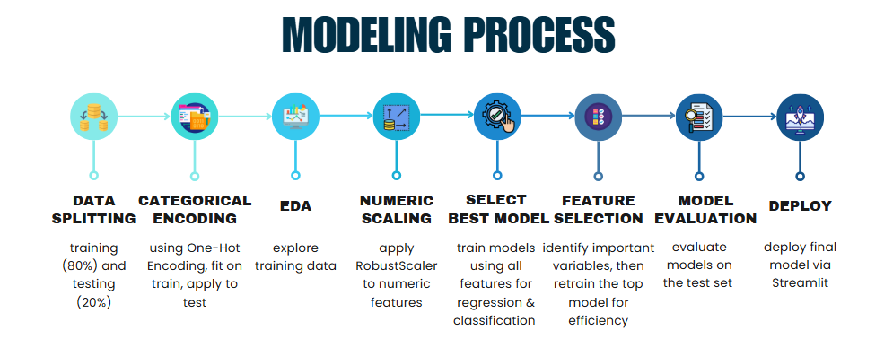
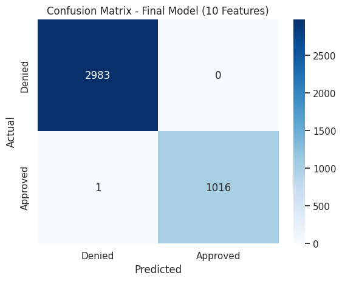

# Credit Risk Prediction & Automated Loan Approval Decision

An end-to-end **Machine Learning application** that predicts **Credit Risk Scores** and automates **Loan Approval** using applicants’ financial and behavioral data.
Deployed via Streamlit, it combines data preprocessing, model training, and explainability (feature importance) in one interactive web app.

## Objectives

### Business Context

In traditional loan processing, assessing credit risk often relies on manual reviews, which are time-consuming, subjective, and prone to inconsistency.
This project aims to help financial institutions **automate credit evaluation**, **enhance decision accuracy**, and **reduce default risk** through data-driven modeling.

### Project Goals

- Automate the assessment of applicants’ credit risk using financial indicators.
- Predict loan approval outcomes based on the predicted credit risk score.
- Identify the most influential factors driving loan approval decisions.
- Provide transparent and scalable decision-making tools for financial institutions.

---

## Project Overview

| Category | Details |
|-----------|--------------|
| **Type** | End-to-End ML Application (Regression + Classification) |
| **Dataset** | [Kaggle - Financial Risk for Loan Approval](https://www.kaggle.com/datasets/lorenzozoppelletto/financial-risk-for-loan-approval/data) |
| **Deployment** | Streamlit |
| **Tools** | Python, Pandas, NumPy, Scikit-learn, XGBoost, LightGBM, SHAP, Feature Importance, Streamlit |

### Workflow

### Key Features
- **Exploratory Data Analysis (EDA)** to identify **data patterns**, understand **applicant profiles**, and **portfolio exposure** from approved loans.
- **Data Preprocessing Pipelines**, used **feature selection**, **RobustScaler** for numerical features, **One-Hot-Emcoding** for categorical features.
- **Risk Score Prediction** using a trained **XGBoost Regressor**. 
- **Automated Loan Decision** using a **LightGBM Classifier**.
- **Interactive Streamlit UI** for predictions.  
- **Model explainability** with feature importance insights.

### Results
**Credit Risk Prediction** → XGBoost Regressor, metrics:
- R² : 0.901
 *Key Takeaways:* model can explain 90% of the variability in the outcome.

**Loan Approval Decision** → LightGBM Classifier, metrics:
- AUC-ROC: 0.999998
- 
 *Key Takeaways:* Very high precision, almost perfect recall (only one false negative case detected) and excellent ability to seperate between approved and declined applicants.

### Insight & Recommendation
- **Low approval rate (24%)** despite strong loan demand reflects a **conservative risk policy**, with Risk Score emerging as the most influential determinant of approval decisions.
  *→ Reevaluate model risk thresholds to responsibly increase loan approvals while maintaining a balanced risk exposure.*
- Approved loans cluster around **moderate risk score (~40),** representing a **total exposure of $91.5M** → validating the model’s credit discrimination capability.
  *→ Refine risk score thresholds to slightly widen acceptance near the moderate-risk boundary, allowing controlled diversification into slightly higher risk tiers and enabling safe credit growth without elevating default risk.*
- Deploy simplified, explainable models to ensure faster, scalable, and transparant credit risk assessment.
  *→ XGBoost Regressor (14 selected features) for risk prediction and Tuned LightGBM Classifier (10 selected features) for loan approval classification.*
- Next Steps: 
  *→ Automate credit evaluation workflows, implement explainability dashboards, and establish continuous retraining cycles to adapt to changing borrower behavior and market conditions.*

  ---

## Skills Demonstrated
- Machine Learning (Regression & Classification)
- Feature Engineering & Data Cleaning
- Model Explainability (Feature Importance & SHAP)
- Streamlit App Development & Deployment
- Business-Oriented Analytical Thinking (Credit Risk Evaluation)

---

## Explore The Project App
Click Streamlit app here:
👉 [Credit Risk Prediction and Automated Loan Approval](https://risk-scoring-and-automated-loan-approval.streamlit.app/)
